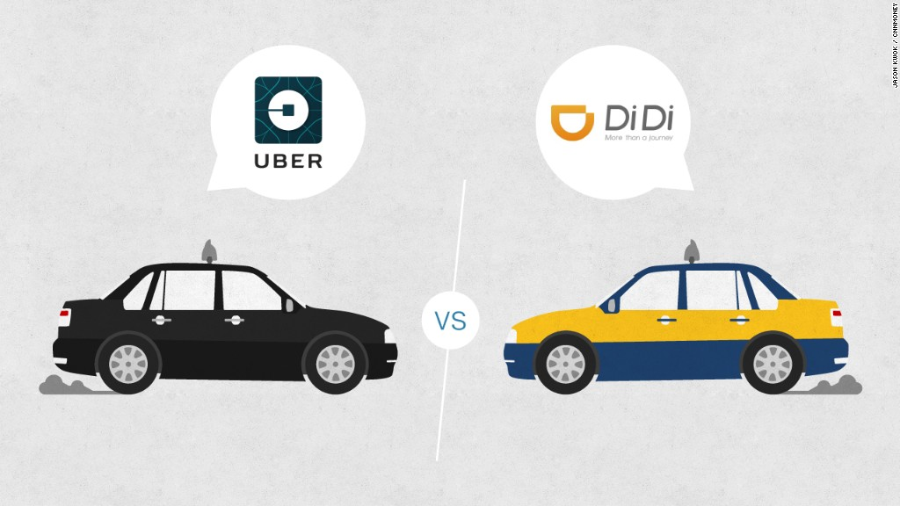

# Liekkas Venture 5: Startup Business

This week, Didi anounced that it had acquired Uber China. Didi chuxing, a company was founded in 2012, now becomes the biggest transportation network company in China. In just about 4 years, Didi is comercial successful just like its rival, Uber, which was founded in 2009 and the biggest transportation network company in the world. We are going to talk about startup business this week. Let's discuss this interesting phenomenon together!

## Notice

Topic：Startup Business  
Time：19:00-21:00 06/08/2016  
Location：**Not Decided Yet**  
Join：Reply “Startup + Name”   
Fee：Go Dutch

## Music
> Paul Simon - Bridge Over Troubled Water

## Agenda

1. **Break the ice**  
    Introduce yourself
2. **Warming up**   
    Talk about latest news, eg.
	- [Uber sells Chinese business to Didi Chuxing](http://www.bbc.com/news/36938812)
    - News you care about
3. **Main topic**  
    Startup Business  
4. **Summary**   
    Disscuss next week's topic.

## Vocabulary Review

Liekkas Venture 5:  Work Overtime(2016.7.30)  

- upperclassman
- performance
- obsession
- monopoly
- poach
- predecessor
- sanitation
- rhinoceros horn

## Liekkas Venture

Let's talk in English!
We believe in connection not perfection!
