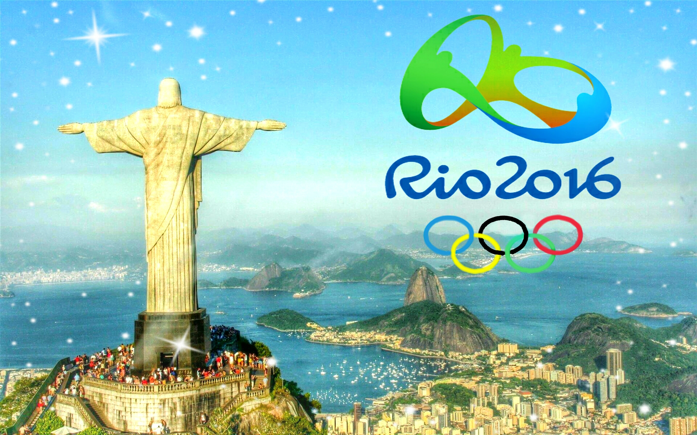

# Liekkas Venture 6: Olympics

Rio Olympics starts from 05 to 21 August, 2016. The best athletes around the world are competing for the greatest honor. Are you a sports fan? How many gold medals can China get? Which sport do you care about the most? Come to join us to talk!

## Notice

Topic：Olympics  
Time：19:00-21:00 14/08/2016  
Location：逸塔  
Join：Reply “Olympics + Name”   
Fee：Go Dutch

## Music

> Shakira - Try Everything (Rio 2016 Summer Olympic Games Theme Song)

	

## Agenda

1. **Break the ice**  
    Introduce yourself
2. **Warming up**   
    Talk about latest news, eg.
	- [Chinese swimmer Fu Yuanhui wins public's heart for rare candor](https://github.com/LiekkasVenture/LiekkasVenture/blob/master/articles/chinese-swimmer-fu-yuanhui-wins-publics-heart-rare-candor.md)
	- [Michael Phelps Wins 22nd Gold Medal as U.S. Swimmers Break New Ground in Rio](https://github.com/LiekkasVenture/LiekkasVenture/blob/master/articles/michael-phelps-rio-2016-olympics-gold-medals-lochte.md)
    - News you care about
3. **Main topic**  
	Olympics
4. **Summary**   
    Disscuss next week's topic.

## Vocabulary Review

Liekkas Venture 5:  Startup Business(2016.8.7)  

- rivalry
- burgeon
- subsidise
- allowance
- acumen
- teapot
- real name authentication
- last edition
- intership
- equity
- IPO(Initial Public Offering)

## Liekkas Venture

Let's talk in English!
We believe in connection not perfection!
