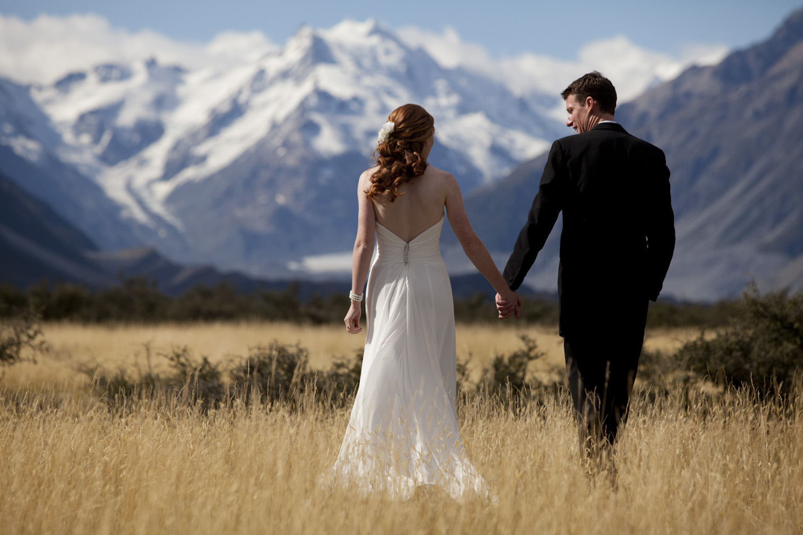

# Liekkas Venture 11: Wedding

> I, XXX  take you  XXX, to be my lawfully wedded (husband/wife), to have and to hold, from this day forward, for better, for worse, for richer, for poorer, in sickness and in health, until death do us part.

Almost everyone dreams about happy marriage. After vowing,  it means the bride and bridegroom begin their new life, they are supposed to support each other, better or worse, richer or poorer, sickness or health, until death.

## Notice

Topic：Wedding
Time：19:00-21:00 08/10/2016  
Location：*not decide yet*  
Join：Reply “Wedding + Name”   
Fee：Go Dutch

## Music

> Marriage D’Amour - Richard Clayderman

	

## Agenda

1. **Break the ice**  
    Introduce yourself
2. **Warming up**   
    Talk about latest news, eg.
	- [China's Shenzhou 11 blasts off on space station mission](http://www.bbc.com/news/world-asia-china-37670842)
	- [Google News launches fact check label](http://www.bbc.com/news/technology-37657524)
    - News you care about
3. **Main topic**  
	Wedding
4. **Summary**   
    Disscuss future topic.

## Vocabulary Review

Liekkas Venture 10: How to Make a Pizza(2016.9.30)  

## Liekkas Venture

Let's talk in English!
We believe in connection not perfection!
