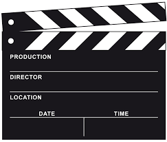

# Liekkas Venture l4: Movie

Movie is a popular art. People enjoy movies not only for amusement, 
but also because they can offer us unique experience and let us think.
Which genre of movies is your favorite?  
Do you like watching movies at the cinema or at home?  
What do you think of Hollywood and domestic movies?  
Let's talk about it this weekend! 

## Notice

Topic：Movie  
Time：15:00-17:00 04/12/2016   
Location：Mangrove  
Join：Reply “Movie + Name”  
Fee：Go Dutch

## Agenda

1. **Break the ice**  
    Introduce yourself.
2. **Warming up**   
    Guess the word.
3. **Main topic**  
    Habit. 
    + Which movie is the most impressive to you?
    + Which genre of movies is your favorite?
    + What do you think of Hollywood and domestic movies?
    ......
4. **Summary**   
    Disscuss future topic.

## Vocabulary Review

Liekkas Venture 13: Habit 
- commission
- dilemma 
- installment
- seesaw
- dwarf
- reap
- observatory
- stunt
- terrace
- cereal
- amateur
- ambiguity
- cuisine
- recipe
- seasick
- carsick

## Liekkas Venture

Let's talk in English!
We believe in connection not perfection!
